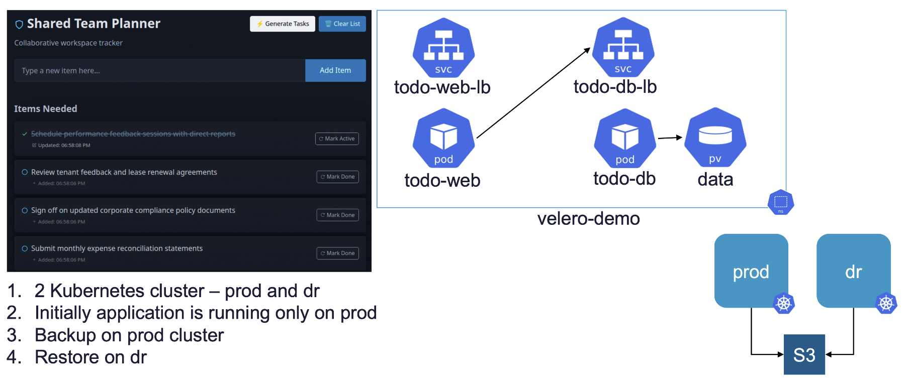

# Simple TODO App

[](https://github.com/yogendra-avgo/todo-app/actions/workflows/ci.yml)
[](https://github.com/yogendra-avgo/todo-app/pkgs/container/todo-app)
[](https://nodejs.org)
[](https://expressjs.com/)
[](https://www.postgresql.org/)

A minimal server-rendered TODO app (Express + htmx + PostgreSQL) used as a demo/test workload
for VKS app-engineering exercises: container builds, CI/CD, Prometheus metrics, load
testing with Locust, and Velero backup/DR.



## Features

- CRUD todo list rendered server-side with [htmx](https://htmx.org/) (no client-side JS framework)
- PostgreSQL-backed storage, with `/api/todos/seed` and `/api/todos/clean` helper endpoints for demos
- `/healthz` liveness/readiness endpoint and a Prometheus `/metrics` endpoint (see `metrics.js`)
- Optional `BASE_PATH` env var so the app can be reverse-proxied under a subpath (e.g. behind a Gateway API route)
- [Locust](https://locust.io/) load-testing setup (`locust/`) for generating traffic during demos
- Kubernetes manifests (`k8s/`) covering namespace/app bootstrap, Istio Gateway/HTTPRoute, and Prometheus PodMonitor/ServiceMonitor
- Velero backup/restore `task` commands for PROD → DR failover demos

## Tech Stack

- **App**: Node.js 18, Express, htmx, Pico CSS
- **Database**: PostgreSQL 15
- **Container**: Docker (multi-stage build), multi-arch (`linux/amd64`, `linux/arm64`)
- **Orchestration**: Kubernetes, Istio Gateway API
- **Observability**: Prometheus (PodMonitor/ServiceMonitor)
- **Backup/DR**: Velero
- **CI/CD**: GitHub Actions + [go-task](https://taskfile.dev/) → [ghcr.io/yogendra-avgo/todo-app](https://github.com/yogendra-avgo/todo-app/pkgs/container/todo-app)

## Prerequisites

- [Docker](https://www.docker.com/) (with buildx)
- [go-task](https://taskfile.dev/)
- [kubectl](https://kubernetes.io/docs/tasks/tools/)
- [Node.js](https://nodejs.org/) 18+

## Local Development

```bash
cp .env.sample .env   # fill in registry/cluster values for your environment

task dev:up           # build & start app + postgres via docker compose
task dev:down         # tear down the local stack
task dev:reboot       # down + up
```

The app is served at http://localhost:3000, backed by a local Postgres container.
Useful data helpers: `task dev:show-data`, `task dev:clean-data`, `task dev:db-shell`.

Run `task --list` to see every available task (dev, cicd, prod, dr, init).

## CI/CD

Defined in [`.github/workflows/ci.yml`](.github/workflows/ci.yml), backed by the `cicd:*`
tasks in [`Taskfile.yml`](Taskfile.yml):

- **On every push** (`test` job): installs dependencies and runs `task cicd:smoke-test`,
  which builds the image and boots it against a throwaway Postgres container to verify
  `/healthz` responds.
- **On a pushed git tag** (`build-and-push` job): builds a multi-arch image and pushes it to
  [`ghcr.io/yogendra-avgo/todo-app`](https://github.com/yogendra-avgo/todo-app/pkgs/container/todo-app),
  tagged with the git tag and `latest`.

```bash
git tag v1.2.3
git push origin v1.2.3   # triggers build-and-push → ghcr.io/yogendra-avgo/todo-app:v1.2.3
```

## Infra Setup

1. Create namespace
2. Create ArgoCD instance
3. Create cluster
4. Create namespace
5. Add cluster to ArgoCD

## App Onboarding

1. Create app
2. Add cluster to ArgoCD
3. Add app to ArgoCD
